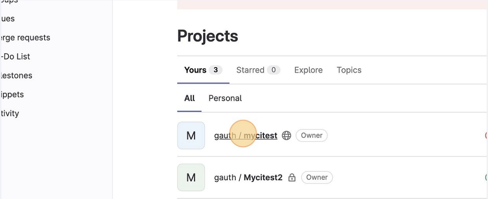
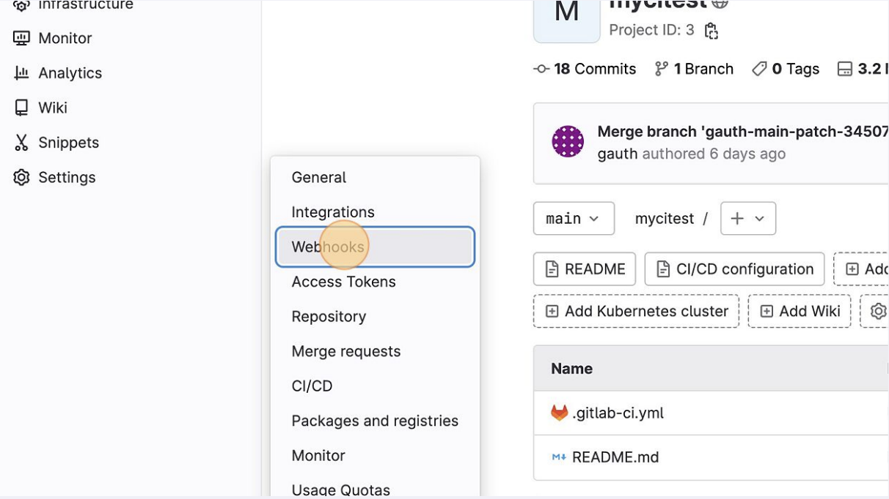
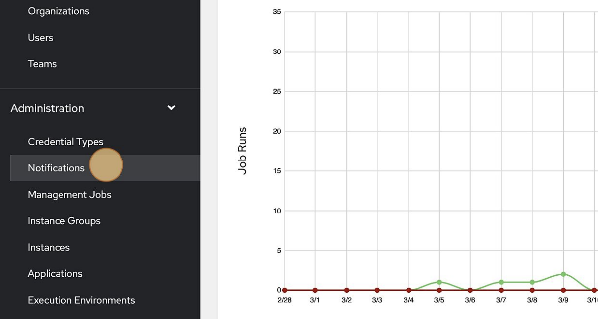
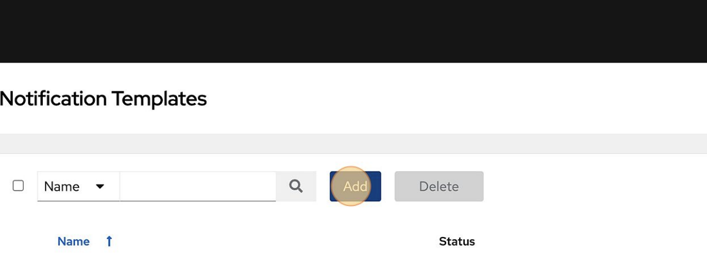
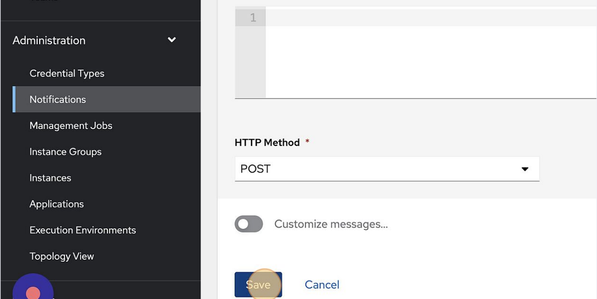
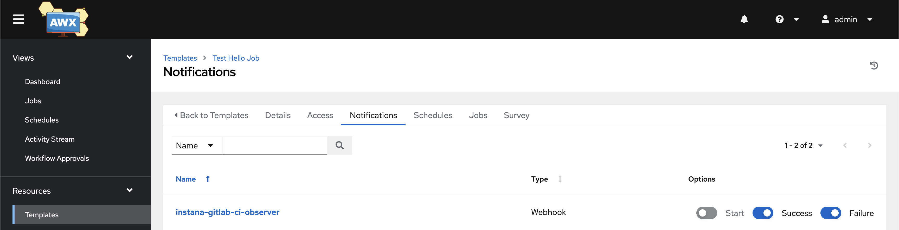
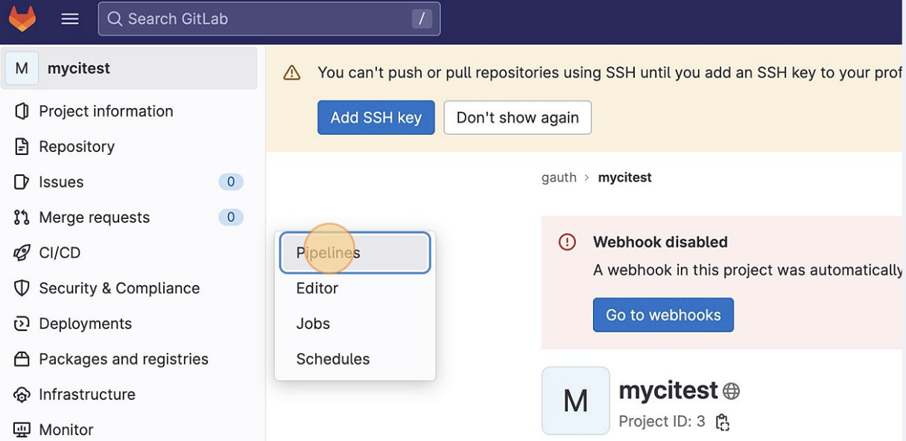
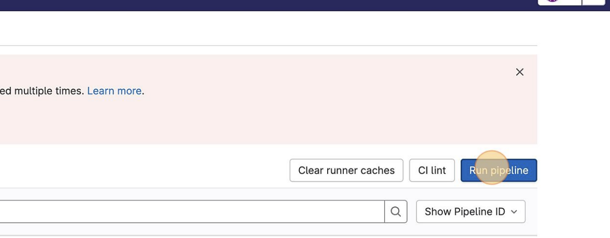
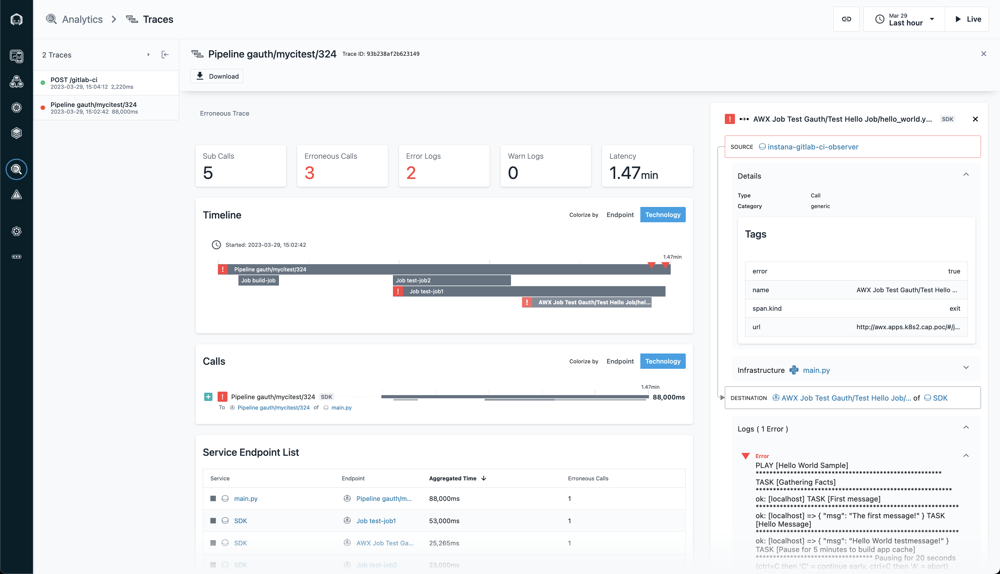

# Instana Gitlab CI Observer

Module that leverages GitLab CI webhooks to send traces to Instana.

## Getting started

### On Virtual Machine

Prereqs:
  - Python `3.x`:
  - Instana agent running on VM running this python module.

1. Populate a `config.yaml` file with required GitLab (and, if applicable, AWX credentials):
    ```yaml
    cat <<EOF > config.yaml
    gitlab:
      url: https://gitlab.example.com/
      api-token: <GITLAB_PERSONNAL_ACCESS_TOKEN>
    awx:
      url: http://awx.example.com
      user: <AWX_USERNAME>
      password: <AWX_PASSWORD>
    EOF
    ```
2. Run the module:
    ```sh
    export INSTANA_DISABLE_AUTO_INSTR=true
    python3 pip install -r requirements.txt
    python3 main.py
    ```

### On Kubernetes/OpenShift


1. Edit the `k8s-resources.yaml` file to add required GitLab and, if applicable, AWX credentials:
    ```yaml
    # k8s-resources.yaml
    ...
    apiVersion: v1
    kind: Secret
    metadata:
    name: instana-gitlab-ci-observer-config
    namespace: instana-gitlab-ci-observer
    type: Opaque
    stringData:
    config.yaml: |
        gitlab:
        url: https://gitlab.example.com # CHANGEME
        api-token: gitlab-pat # CHANGEME
        awx:
        url: http://awx.example.com # CHANGEME
        user: admin # CHANGEME
        password: adminPassword # CHANGEME
    ...
    ```
    - **Note** to create the GitLab personnal access token, navigate to your gitlab instance, click your user profile on the top right, then **Preferences** > **Access Tokens**, select the scope `read_api` then click **Create personnal access token**.
2. Deploy the module by applying the resources:
    ```sh
    kubectl apply -f k8s-resources.yaml
    ```
3. Add the webhook on your GitLab instance:
   1. Naviage to your project in your GitLab instance
        
   2. On the left navigation panel, select **Settings**, then **Webhooks**
        
   3. Enter URL `http://instana-gitlab-ci-observer:instana-gitlab-ci-observer:8088/gitlab-ci`
   4. Select **Job events** and **Pipeline events** scopes
        
   5. Disable **SSL verification**, then click **Add webhook**:
        
4. Add the webhook on your AWX instance:
   1. Naviage to the **Notifications** in your AWX instance:
        
   2. Click **Add**:
        
   3. Chose notification name, type Target URL `http://instana-gitlab-ci-observer:instana-gitlab-ci-observer:8088/awx`, chose **Webhook** as notification type then click **Save**:
        
   4. Navigate to **Templates**, select your Ansible template, go to **Notifications** tab and enable notification webhook for that template (success and failure):
        
5. Finally, run the pipeline in GitLab:
   1. Naviage to your project in your GitLab instance
        
   2. Navigate to **CI/CD** > **Pipelines**:
        
   3. Click **Run pipelines**, type your variables then click **Run pipelines**:
        
6. When pipeline ends, you will see the trace in Instana:
        
   